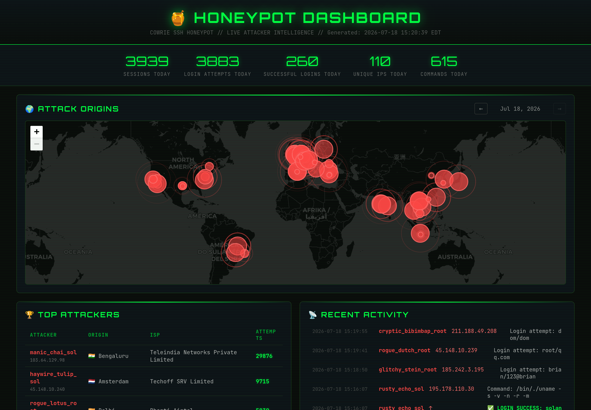

# 🍯 Honeypot Dashboard

A **Cowrie SSH honeypot** disguised as a Solana validator node, with a live web dashboard showing real-time attacker sessions, geolocation, and LLM-generated behavior descriptions.




## What It Does

This project runs an SSH honeypot that masquerades as a misconfigured Solana validator node. When attackers connect, Cowrie logs every login attempt, shell command, and file download. The dashboard processes these logs and presents:

- **Live attack map** — Geographic visualization of attacker origins using Leaflet.js
- **Attacker leaderboard** — Top attackers ranked by attempts, with nicknames and ISP info
- **Session replays** — What attackers typed after logging in, with command annotations
- **LLM-generated descriptions** — Natural language summaries of attacker behavior (e.g., "Full hardware audit — profiling this box for cryptomining potential")
- **Credential analytics** — Most common username/password combinations tried
- **Daily breakdowns** — Session counts, unique IPs, and success rates over time

## Architecture

```
Internet → Port 22 (iptables NAT) → Cowrie honeypot (sandboxed)
                                          ↓
                                      JSON logs
                                          ↓
                     generate.py (parse + GeoIP + LLM describe + render HTML)
                                          ↓
                                    dashboard.html (self-contained)
                                          ↓
                           serve.py ← nginx reverse proxy (HTTPS)

                     analytics.py (incremental session analysis, geo tracking)
```

### Data Flow

1. **Cowrie** captures SSH connections on port 22 (via iptables NAT redirect) and logs events as JSON
2. **generate.py** runs every 5 minutes via cron, parses the last 7 days of logs, performs batch GeoIP lookups, generates LLM descriptions for interesting sessions, and renders a self-contained HTML dashboard
3. **serve.py** serves the dashboard on localhost, behind nginx with TLS and HTTP basic auth
4. **analytics.py** runs every 5 minutes, incrementally processing new log entries and maintaining aggregated statistics with 30-day retention

## The Bait

The honeypot is themed as a **Solana validator node** to attract crypto-targeting attackers:

- Fake Solana wallet with seed phrases in `.env`
- Planted credentials in `.bash_history`
- Realistic validator configuration files (keypair, stake account, vote account)
- Enticing directory structure that rewards exploration
- Fake systemd service for `solana-validator`

This disguise is effective — many attackers specifically try Solana-related credentials (`solana:solana`, `sol:validator`, `validator:validator`).

## Key Features

### Session Intelligence
- **3-layer description system:** Dictionary lookup → regex pattern matching → LLM generation (via Ollama)
- **Attacker nicknames:** Country-themed names (e.g., `tulip_sol`, `dragon_root`) based on origin and behavior
- **Command annotations:** Inline technical notes on what each command does and why an attacker would run it
- **Description caching:** LLM descriptions are cached to avoid redundant inference

### Robustness
- **Incremental log processing** — Byte-offset tracking, doesn't re-read entire log files
- **Log rotation detection** — Handles file size changes gracefully (no line-counting fragility)
- **Atomic file writes** — All JSON caches and the dashboard HTML use temp file + `os.rename` to prevent corruption
- **Gzip-aware parsing** — Detects rotated `.gz` logs by magic bytes, not file extension
- **Session deduplication** — Events are deduped by (session, timestamp, eventid)
- **7-day rolling window** — Dashboard shows recent activity, not all-time data
- **30-day data retention** — Analytics pruning prevents unbounded disk growth
- **Ollama health checks** — Gracefully skips LLM descriptions if Ollama is down; uses cached/pattern-matched descriptions instead

### Security Hardening
- **XSS prevention** — All attacker-controlled data (usernames, passwords, commands, ISP names) is HTML-escaped before rendering
- **Directory traversal protection** — `serve.py` only serves `dashboard.html`; all other paths return 404
- **HTTPS rate limiting** — nginx `limit_req` on both HTTP and HTTPS endpoints prevents brute-forcing
- **Localhost binding** — `serve.py` binds to `127.0.0.1` only; nginx handles external access
- **HTTP basic auth** — Dashboard is password-protected
- **No sensitive data in output** — The generated HTML contains only attacker IPs and their activity, not server configuration

### Dashboard UI
- Dark hacker-aesthetic theme with CRT scanline effect
- Interactive Leaflet.js map with pulsing markers
- Chart.js visualizations for credentials and attack timeline
- Click-to-fly: click any attacker nickname to zoom to their location on the map
- Mobile-responsive layout
- Auto-refresh every 30 seconds

## File Structure

```
honeypot-dashboard/
├── README.md
├── LICENSE
├── .gitignore
├── Dockerfile                  # Python 3.12 image for the dashboard
├── docker-compose.yml          # Containerized deployment (host networking)
├── Makefile                    # test / build / up / down / logs
├── requirements-test.txt       # pytest + syrupy + pytest-mock
├── deploy/                     # iptables-redirect units + email watchdog
├── docs/                       # screenshot
├── app/
│   ├── generate.py             # Log parser + GeoIP + LLM + HTML renderer
│   ├── serve.py                # HTTP server (localhost:9999, behind nginx)
│   ├── analytics.py            # Incremental analytics with byte-offset tracking
│   └── scheduler.py            # Container supervisor (serve + periodic regen)
├── tests/                      # pytest suite (parser, pipeline, XSS, regressions)
└── data/                       # Runtime data, bind-mounted to /data (gitignored)
    ├── dashboard.html          #   generated output
    ├── description_cache.json  #   LLM description cache
    ├── geoip_cache.json        #   GeoIP lookup cache
    └── analytics.json          #   aggregated analytics data
```

## Setup

### Prerequisites

- A VPS or server you're comfortable exposing to the internet
- Docker + Docker Compose (recommended) — or Python 3.12+ for a bare-metal run
  (the dashboard uses 3.12-only f-string syntax and will not parse on 3.10/3.11)
- [Cowrie](https://github.com/cowrie/cowrie) SSH/Telnet honeypot
- [Ollama](https://ollama.ai/) with a small model (e.g., `qwen3.5:9b`) — optional but recommended
- nginx with Let's Encrypt for TLS

> The dashboard itself runs in a container (see **Run with Docker** below).
> Cowrie and Ollama stay as host services — Cowrie is the live honeypot capturing
> traffic, and Ollama is the shared LLM backend; the container talks to both over
> the host network. Steps 4–5 (cron + systemd) are only for a bare-metal run.

### 1. Install Cowrie

Follow the [official Cowrie installation guide](https://cowrie.readthedocs.io/en/latest/INSTALL.html). Key steps:

```bash
# Create cowrie user
sudo adduser --disabled-password cowrie

# Clone and set up Cowrie
sudo -u cowrie git clone https://github.com/cowrie/cowrie /home/cowrie/cowrie
cd /home/cowrie/cowrie
sudo -u cowrie python3 -m venv cowrie-env
sudo -u cowrie ./cowrie-env/bin/pip install -r requirements.txt

# Configure Cowrie to listen on a high port (e.g., 2223)
# Then redirect port 22 to it via iptables:
sudo iptables -t nat -A PREROUTING -p tcp --dport 22 -j REDIRECT --to-port 2223

# Move your real SSH to a non-standard port first!

# A raw iptables rule does NOT survive a reboot (and the Docker daemon rebuilds
# the nat table on start and can drop it). Install the bundled unit to re-apply
# the redirect on every boot, ordered after Docker:
sudo cp deploy/honeypot-redirect.service /etc/systemd/system/
sudo systemctl enable --now honeypot-redirect.service
```

### 2. Install the Dashboard

```bash
# Clone this repo
git clone https://github.com/brezgis/honeypot-dashboard.git /home/dashboard

# Install Ollama (optional, for LLM descriptions)
curl -fsSL https://ollama.com/install.sh | sh
ollama pull qwen3.5:9b  # the default model in generate.py — or edit llm_generate() to use another

# The dashboard reads logs from Cowrie's default location:
#   /home/cowrie/cowrie/var/log/cowrie/cowrie.json
# If your Cowrie logs are elsewhere, set COWRIE_LOG_PATH (see Configuration).
```

### 3. Configure nginx

Example nginx config for HTTPS with Let's Encrypt:

```nginx
limit_req_zone $binary_remote_addr zone=dashboard:10m rate=5r/s;

server {
    listen 443 ssl;
    server_name your-domain.example.com;

    ssl_certificate /etc/letsencrypt/live/your-domain.example.com/fullchain.pem;
    ssl_certificate_key /etc/letsencrypt/live/your-domain.example.com/privkey.pem;

    limit_req zone=dashboard burst=10 nodelay;
    auth_basic "Honeypot Dashboard";
    auth_basic_user_file /etc/nginx/.htpasswd;

    location / {
        proxy_pass http://127.0.0.1:9999;
        proxy_set_header Host $host;
        proxy_set_header X-Real-IP $remote_addr;
    }
}
```

Create the password file:
```bash
sudo apt install apache2-utils
sudo htpasswd -c /etc/nginx/.htpasswd your-username
```

### 4. Set Up Cron Jobs

```bash
# Run as the dashboard user (not root)
crontab -e

# Regenerate dashboard every 5 minutes
*/5 * * * * cd /home/dashboard/app && /usr/bin/python3 generate.py >> /var/log/honeypot-dashboard.log 2>&1

# Run analytics every 5 minutes (stagger by 2 minutes to avoid contention)
2-57/5 * * * * cd /home/dashboard/app && /usr/bin/python3 analytics.py >> /var/log/honeypot-analytics.log 2>&1
```

### 5. Start the Server

```bash
# Run serve.py as a systemd service or in screen/tmux
cd /home/dashboard/app
python3 serve.py
```

Or create a systemd service:
```ini
[Unit]
Description=Honeypot Dashboard Server
After=network.target

[Service]
User=dashboard
WorkingDirectory=/home/dashboard/app
ExecStart=/usr/bin/python3 serve.py
Restart=always
RestartSec=5

[Install]
WantedBy=multi-user.target
```

## Run with Docker (recommended)

The dashboard ships as a single container that supervises `serve.py` plus the
periodic `generate.py` / `analytics.py` runs (`app/scheduler.py` — no host cron or
systemd unit needed). It uses **host networking**, so it binds `127.0.0.1:9999`
and reaches host Ollama on `localhost:11434` exactly like the bare-metal process
did — the nginx config in front of it (step 3) needs no changes.

Cowrie and Ollama remain host services; the container mounts Cowrie's log
directory read-only and writes its caches/output to a bind-mounted `./data` dir.

```bash
# 1. Get the code onto the host
git clone https://github.com/brezgis/honeypot-dashboard.git /opt/honeypot-dashboard
cd /opt/honeypot-dashboard

# 2. Free port 9999 by stopping any bare-metal dashboard service
sudo systemctl disable --now honeypot-dashboard.service   # if it exists

# 3. (Optional but recommended) seed ./data with existing caches so the first
#    run doesn't re-fetch thousands of GeoIP lookups / re-generate descriptions
mkdir -p data
sudo cp /home/dashboard/app/{geoip_cache.json,description_cache.json,analytics.json,dashboard.html} data/ 2>/dev/null || true

# 4. Build and start
docker compose up -d --build
docker compose logs -f --tail=50    # watch the first generate/analytics run
```

The container restarts automatically (`restart: unless-stopped`). To run the
test suite in a matching Python 3.12 container: `make test`.

### Container configuration (env)

All set in `docker-compose.yml`; the same variables work for a bare-metal run.

| Variable | Default | Description |
|----------|---------|-------------|
| `COWRIE_LOG_PATH` | `/home/cowrie/cowrie/var/log/cowrie/cowrie.json` | Cowrie JSON log location (`/cowrie-logs/cowrie.json` in-container) |
| `HONEYPOT_DATA_DIR` | next to the scripts | Where caches, `analytics.json`, and `dashboard.html` are written (`/data` in-container) |
| `OLLAMA_URL` | `http://localhost:11434` | Ollama endpoint for LLM descriptions |
| `SERVE_HOST` | `127.0.0.1` | Address `serve.py` binds (set `0.0.0.0` for bridge networking) |
| `SERVE_PORT` | `9999` | HTTP server port |
| `REGEN_INTERVAL` | `300` | Seconds between dashboard/analytics regenerations |
| `SERVE_REGEN_ON_START` | `1` | Whether `serve.py` regenerates on startup (the scheduler sets `0`) |

The container runs as **non-root** (uid 10001) and joins the host's `cowrie`
group for log reads — check `getent group cowrie` and adjust the `group_add`
gid in `docker-compose.yml` if yours isn't `988`. Because the container is
non-root, the bind-mounted `./data` must be writable by that uid — one-time on
the host:

```bash
sudo chown -R 10001:10001 data
```

### Keeping it running (`deploy/`)

- **`honeypot-redirect.service`** + **`docker-honeypot-redirect.conf`** — keep the
  port-22 → Cowrie(2223) iptables redirect in place across reboots *and* Docker
  daemon restarts (Docker rebuilds the nat table on start and can drop the rule):

  ```bash
  sudo cp deploy/honeypot-redirect.service /etc/systemd/system/
  sudo systemctl enable --now honeypot-redirect.service
  sudo mkdir -p /etc/systemd/system/docker.service.d
  sudo cp deploy/docker-honeypot-redirect.conf /etc/systemd/system/docker.service.d/honeypot-redirect.conf
  sudo systemctl daemon-reload
  ```

- **`honeypot-watchdog.sh`** — emails (via Resend) if the redirect goes missing,
  the container stops, the dashboard stops regenerating, or Cowrie stops
  capturing. Install, configure, and cron it:

  ```bash
  sudo cp deploy/honeypot-watchdog.sh /usr/local/bin/ && sudo chmod 755 /usr/local/bin/honeypot-watchdog.sh
  sudo tee /etc/honeypot-watchdog.env >/dev/null <<'EOF'
  RESEND_API_KEY=re_...
  ALERT_FROM="Honeypot Watchdog <honeypot@mail.example.com>"
  ALERT_TO=you@example.com
  DASHBOARD_URL=https://your-domain.example.com/
  EOF
  sudo chmod 600 /etc/honeypot-watchdog.env
  /usr/local/bin/honeypot-watchdog.sh --test     # confirm email delivery
  ( sudo crontab -l 2>/dev/null; echo '*/15 * * * * /usr/local/bin/honeypot-watchdog.sh' ) | sudo crontab -
  ```

## Configuration

A few non-env settings live at the top of each script:

| Setting | File | Default | Description |
|---------|------|---------|-------------|
| `LOCAL_TZ` | `generate.py` | `America/New_York` | Timezone for dashboard timestamps |
| `MIN_REGEN_INTERVAL` | `serve.py` | `30` | Minimum seconds between on-demand regenerations |
| `RETENTION_DAYS` | `analytics.py` | `30` | Days to keep analytics data before pruning |

### LLM Model
The LLM model is specified in `generate.py`'s `llm_generate()` function (`qwen3.5:9b`).
Any Ollama-compatible model works — smaller models are faster, larger ones produce
better descriptions. If Ollama is unreachable, descriptions fall back to
template/regex generation and the dashboard still renders.

## Companion: Discord Alert Bot

A separate watcher script (not included in this repo) can monitor Cowrie logs in real-time and send Discord alerts for successful logins, interesting commands, and file downloads. It runs on a separate machine and reads logs via SSH, providing immediate notification of attacker activity.

## Tech Stack

- **[Cowrie](https://github.com/cowrie/cowrie)** — SSH/Telnet honeypot framework
- **Python 3** — Dashboard generation, HTTP serving, analytics
- **[Ollama](https://ollama.ai/)** — Local LLM inference for session descriptions
- **[Leaflet.js](https://leafletjs.com/)** — Interactive attack origin map
- **[Chart.js](https://www.chartjs.org/)** — Credential and timeline visualizations
- **[ip-api.com](https://ip-api.com/)** — Batch GeoIP lookups (free tier)
- **nginx** — Reverse proxy with TLS termination and rate limiting
- **Let's Encrypt** — Free TLS certificates via certbot

## How the LLM Descriptions Work

The description system uses a 3-layer approach for efficiency:

1. **Layer 1 — Command annotations** (instant): A dictionary maps ~50 common commands to short technical notes (e.g., `uname -a` → "OS/kernel identification"). Plus ~40 regex patterns for compound commands.

2. **Layer 2 — Pattern matching** (instant): Regex-based classification of common attack patterns. Returns varied descriptions (8+ options per category, seeded by IP hash for deterministic output).

3. **Layer 3 — LLM generation** (cached): For novel sessions that don't match known patterns, a few-shot prompt sends the session details to a local Ollama model. The response is cached in `description_cache.json`, so each unique session is only described once.

The prompt uses a raw/few-shot format with real examples to guide the model toward concise, technical, opinionated descriptions. Bad outputs (meta-commentary, refusals, too-short responses) are detected and filtered.

## Made by

Anna Brezgis and Claude — [brezgis.com](https://brezgis.com)

## License

MIT — see [LICENSE](LICENSE).
